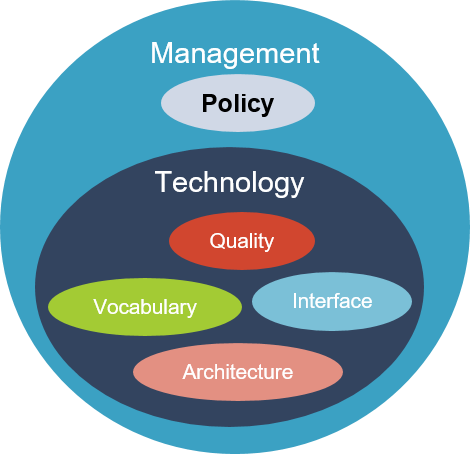

# Interoperability Framework

[Previous](Framework.md) | [Table of contents](README.md) | [Next](Vocabulary.md)
***

In order to guide and structure the overall Interoperability related activities within CEOS, a framework was proposed and developed. Five areas have been identified as critical ‘factors’ needed to move towards greater interoperability of EO data and services.

Each factor has several components and are summarized as below.

<!-- Note that the number of :-- is important for formatting the PDF -->
| Factor | Description |
| :-- | :------ |
| **Vocabulary (Semantics)** | The (narrow) semantic aspect refers to the naming and defining terms and expression. It includes developing, harmonizing, and maintaining vocabularies, concepts, and schemata supporting provision, exchange, and analysis of data, information, and knowledge regarding Earth observation. It ensures that words and language are understood in the same way by all communicating parties |
| **Architecture** | Architecture describes the organizational structure of concepts, processes, and assets, including data. It comprises of the structural aspects of models and standards that govern the collection, storage, archiving, documentation and publication of data |
| **Interface (Accessibility)** | Data exchange protocols and application interfaces, from a consumption or user perspective. These provide the means necessary to search for collections, find and access data and information contained in those collections |
| **Quality** | Indicators (parameters, metrics, etc.) for informing users of the trustworthiness (accuracy, uncertainty, consistency, etc.) of the data provided (measurands, measurements, observations, etc.). |
| **Policy** | Legal frameworks, policies, rules, and strategies regulating the relation between the different stakeholders. |

The factors together intend to cover all aspects that play a role in enabling interoperability of data and services. Design criteria for the
factors are cohesion, independence, and modularity. Cohesion (internally) is accomplished by grouping them according to specific knowledge
and competences required to tackle the respective issues. This ‘separation of concerns’ known from system engineering should ensure that
the individual aspects are addressed in the most adequate way by experts of the respective fields without having to deal with the complexity
of the entire system all the time. Independence means that specific (fundamental) aspects (e.g., data formats) should be proprietary to one
factor. In this way parallel or duplicate solution development can be avoided. Modularity must ensure that all factors together build a
functional ensemble in which it is clear which covers what and how they all work together.

The interoperability factors collate certain, expected-to-be related, competencies that should be considered whenever interoperability is
desired or required in a project or process. Most CEOS activities are targeted at enhancing interoperability and thus they all should scrutinize
their work with respect to the framework factors.

***
[Previous](Framework.md) | [Table of contents](README.md) | [Next](Vocabulary.md)
